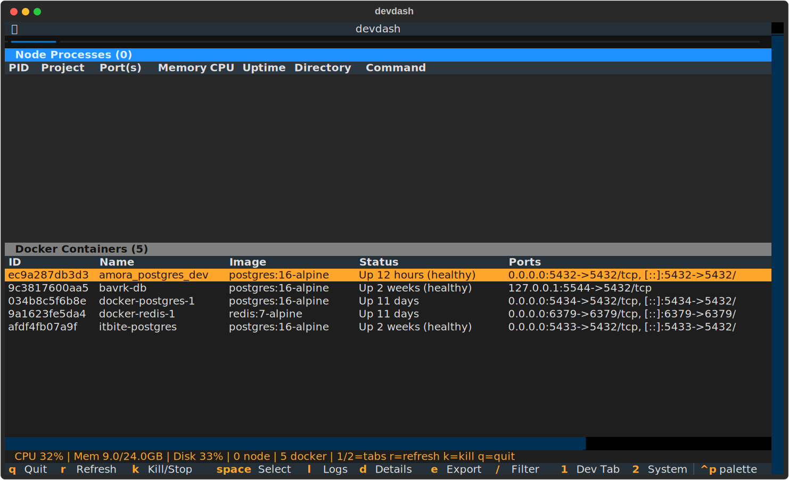
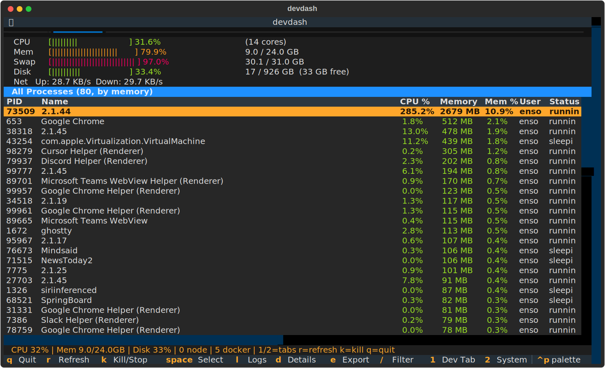
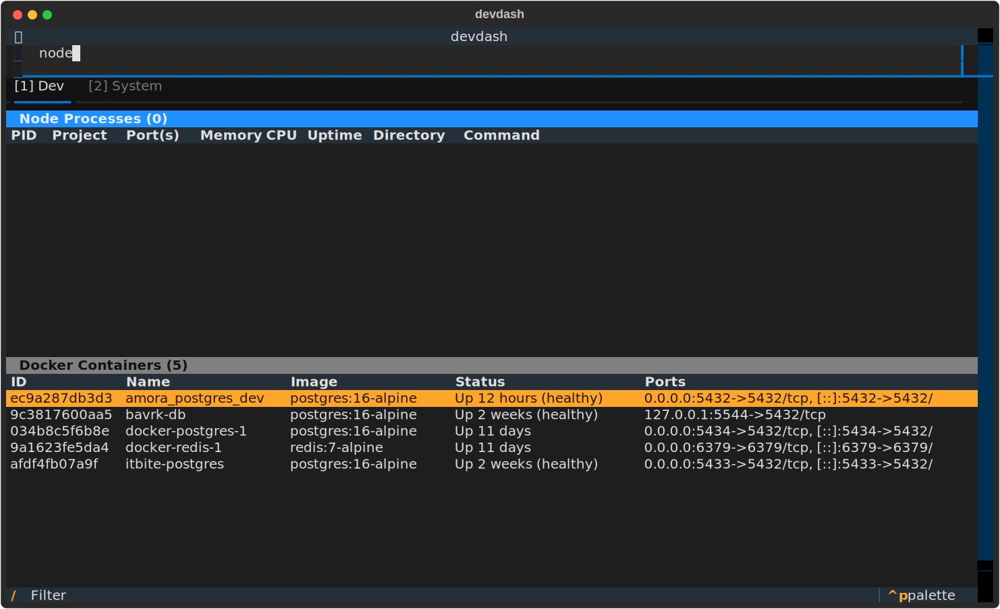

# devdash

A terminal dashboard for developers to monitor and manage Node.js processes and Docker containers from one place.

Built with [Textual](https://textual.textualize.io/) and [psutil](https://github.com/giampaolo/psutil).



## Why

If you use Claude Code (or any AI coding agent) to work across multiple projects, you quickly end up with a mess of orphaned Node dev servers, runaway builds, and forgotten Docker containers eating your RAM in the background. You switch between projects, Claude spins up `next dev` or `vite` on port 3000, you move on, and now three instances are fighting over the same port while your fan screams.

devdash exists to give you a single pane of glass for all of it:

- **See every Node process at a glance** -- which ports they hold, how much memory they burn, which project they belong to (read straight from `package.json`).
- **See every Docker container** -- status, ports, Compose project, and service name. No more `docker ps` in a separate terminal.
- **Kill or stop anything in two keystrokes** -- `k` to kill, `y` to confirm. Batch-select with `space` and wipe out a whole stack at once.
- **Stream container logs without leaving the dashboard** -- press `l` on a container row and tail its output in a modal. `Esc` to close.
- **Get notified when things crash** -- toast notifications when a tracked process exits or a container disappears, so you catch it immediately instead of wondering why your API stopped responding.
- **Filter, sort, and export** -- slash-search across all columns, click headers to sort, press `e` to dump a JSON snapshot for later analysis.

It auto-refreshes every 3 seconds (configurable), preserves your cursor position, and degrades gracefully when Docker isn't running.

## Screenshots

### Dev Tab

Node processes and Docker containers side by side. Color-coded CPU/memory, project names from `package.json`, Compose project and service columns.


### System Tab

System resource gauges (CPU, memory, swap, disk, network) and a full process list sorted by memory.



### Filter

Press `/` to filter across all columns. Matches persist across auto-refresh.



## Install

Requires Python 3.10+ and git.

```sh
curl -fsSL https://raw.githubusercontent.com/enso-works/devdash/main/install.sh | bash
```

This clones to `~/.devdash`, creates a virtualenv, and symlinks the binary to `~/.local/bin/devdash`.

Running the installer again will update an existing installation (idempotent).

## Usage

```sh
devdash                          # launch with defaults
devdash --config path/to/config  # use custom config file
devdash --version                # print version
devdash --update                 # pull latest and reinstall
```

## Uninstall

```sh
rm -rf ~/.devdash ~/.local/bin/devdash
```

## Keybindings

| Key | Action |
|-----|--------|
| `q` | Quit |
| `r` | Refresh data |
| `k` | Kill process / stop container |
| `l` | View Docker container logs (streaming) |
| `d` | View process details (env, files, connections) |
| `e` | Export snapshot to JSON |
| `/` | Toggle search/filter bar |
| `space` | Toggle row selection for batch operations |
| `tab` | Switch between tables in current tab |
| `1` / `2` | Switch to Dev / System tab |
| `ctrl+p` | Open command palette |
| `Esc` | Close filter bar or modal |

Click any column header to sort. Click again to reverse.

## Tabs

### Dev Tab

- **Node Processes** -- All running Node.js processes with PID, project name (from `package.json`), listening ports, memory, CPU, uptime, working directory, and command.
- **Docker Containers** -- Running containers with ID, name, image, status, ports, uptime, and Docker Compose project/service columns.

### System Tab

- **Resource gauges** -- CPU, memory, swap, disk usage with color-coded bars. Network bandwidth (upload/download rates).
- **All Processes** -- Top processes by memory (configurable limit) with CPU, memory, user, status.

## Features

**Color coding** -- CPU and memory cells are green (<50%), yellow (50-80%), or red (>80%). Thresholds are configurable.

**Search/filter** -- Press `/` to open the filter bar. Case-insensitive substring match across all visible columns. Persists across auto-refresh cycles.

**Sorting** -- Click any column header to sort ascending. Click again for descending. Sort persists across refreshes.

**Project detection** -- Walks up from each Node process's working directory to find `package.json` and reads the `name` field. Results are cached.

**Docker Compose awareness** -- Parses `com.docker.compose.project` and `com.docker.compose.service` labels. Containers are grouped by compose project.

**Docker logs** -- Press `l` on a Docker container to stream its logs in a modal. Uses `docker logs --tail 100 --follow`. Press `Esc` to close.

**Process details** -- Press `d` on any process to view environment variables, open files, network connections, threads, and child processes.

**Multi-select** -- Press `space` to select/deselect rows. Selected rows are marked with `*`. Press `k` to batch kill/stop all selected items with a single confirmation.

**Crash notifications** -- Toast notifications when a tracked Node process exits or a Docker container disappears. Also notifies when new processes appear on listening ports.

**Export** -- Press `e` to write the current state to `~/.local/share/devdash/snapshot-{timestamp}.json`.

**Command palette** -- Press `ctrl+p` to search and execute any action by name.

## Configuration

Optional config file at `~/.config/devdash/config.toml`:

```toml
refresh_rate = 3.0          # seconds between auto-refresh
process_limit = 80          # max processes shown in System tab
watched_ports = [3000, 8080] # notify when a process binds these ports
color_threshold_low = 50.0  # green -> yellow boundary (%)
color_threshold_high = 80.0 # yellow -> red boundary (%)
```

Override the config path:

```sh
devdash --config ~/my-config.toml
```

## Project Structure

```
devdash/
  __init__.py   # version constant
  app.py        # main TUI app, layout, bindings, data flow
  cli.py        # entry point with argparse
  config.py     # config file loading (tomllib)
  processes.py  # process discovery, docker queries, system stats
  screens.py    # modal screens (confirm, log viewer, process details)
  updater.py    # git-based self-update logic
install.sh      # one-line installer
pyproject.toml  # package metadata and dependencies
run.sh          # convenience launcher
```

## Dependencies

- [textual](https://pypi.org/project/textual/) -- TUI framework
- [psutil](https://pypi.org/project/psutil/) -- process and system monitoring
- Docker CLI (optional, for container features)

## License

MIT
