# devdash

[](https://github.com/enso-works/devdash/actions/workflows/macos-app.yml)
[](https://github.com/enso-works/devdash/releases)


See and manage your dev servers, Docker containers and Claude Code sessions from one place. It comes as a terminal dashboard and a native macOS menu bar app.

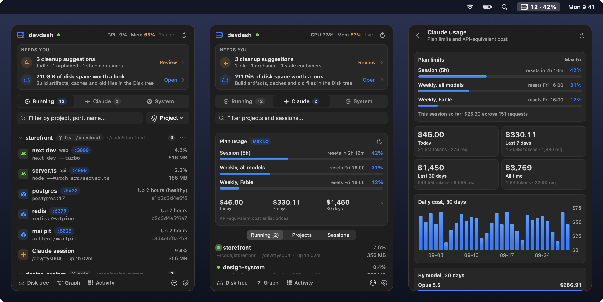

## Why

If you use Claude Code (or any AI coding agent) across several projects, background processes pile up fast. You end up with orphaned `next dev` servers, runaway builds and forgotten Docker containers, and three copies of the same app fighting over port 3000 while your fan spins up.

devdash shows all of it on one screen:

- **Dev servers**: every Node process with the ports it holds, its memory and CPU, and the project it belongs to (read from `package.json`).
- **Docker**: containers grouped by Compose stack, with status, health and ports.
- **Cleanup**: flags idle, orphaned and zombie processes and long-running containers, and lets you remove them in one click.
- **Claude Code**: running sessions, projects and recent sessions. Resume any of them in a new Terminal window.
- **Claude usage**: your plan limits (5-hour session and weekly) and what your usage would cost at API prices.
- **System**: CPU, memory, swap, disk, network and the heaviest processes.

## Install

Requires Python 3.10+ and git. On macOS this also installs the menu bar app.

```sh
curl -fsSL https://raw.githubusercontent.com/enso-works/devdash/main/install.sh | bash
```

Options go on the `bash` side of the pipe:

```sh
curl -fsSL https://raw.githubusercontent.com/enso-works/devdash/main/install.sh | VERSION=0.2.0 bash  # pin a version
curl -fsSL https://raw.githubusercontent.com/enso-works/devdash/main/install.sh | NO_APP=1 bash       # CLI only
```

The installer:
- clones devdash to `~/.devdash`, creates a virtualenv, and links `devdash` into `~/.local/bin`;
- on macOS, puts `DevDash.app` in `~/Applications`.

Run it again to update. You can also run `devdash --update`, or use the prompt the app shows when it needs a newer CLI.

## Menu bar app (macOS)

```sh
open ~/Applications/DevDash.app
```

The menu bar shows how many dev servers and containers are running, plus your current Claude session usage (for example `9 · 42%`). The icon switches to a flame when CPU or memory goes over your configured threshold. Click it to open the dashboard.

| Dev servers | Docker | System |
|---|---|---|
| 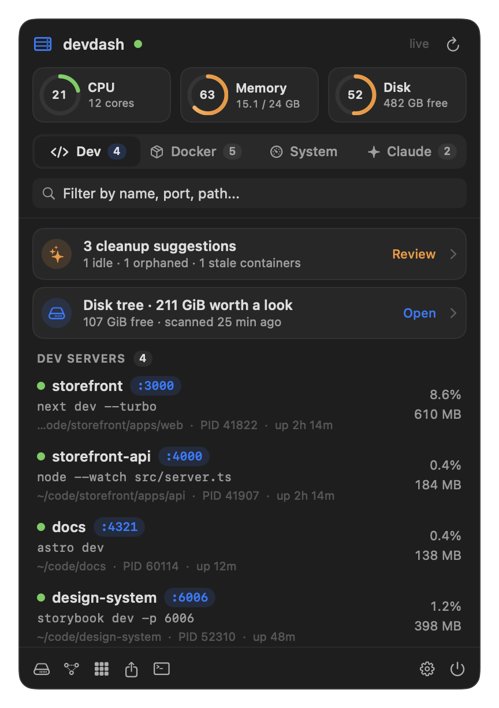 | 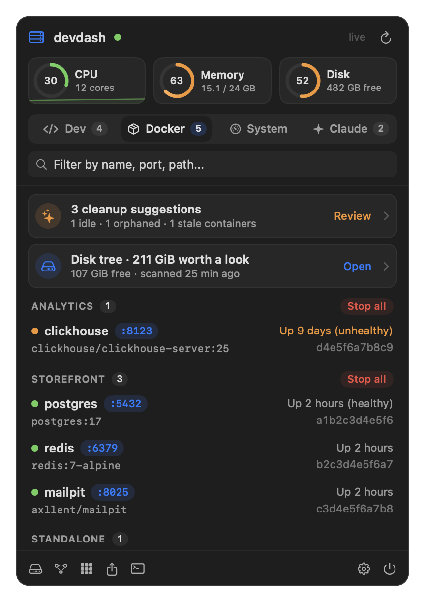 | 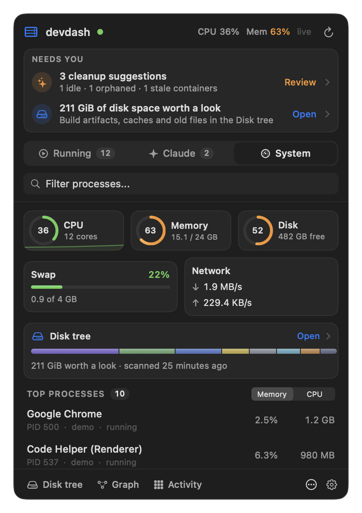 |
| **Claude** | **Claude usage** | **Cleanup** |
| 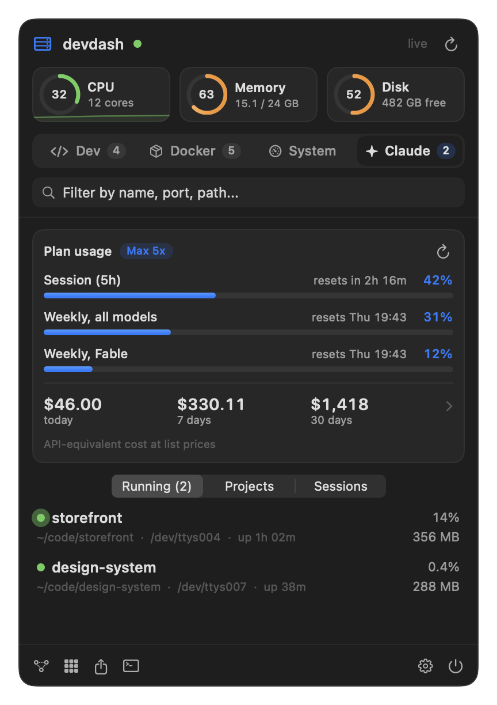 | 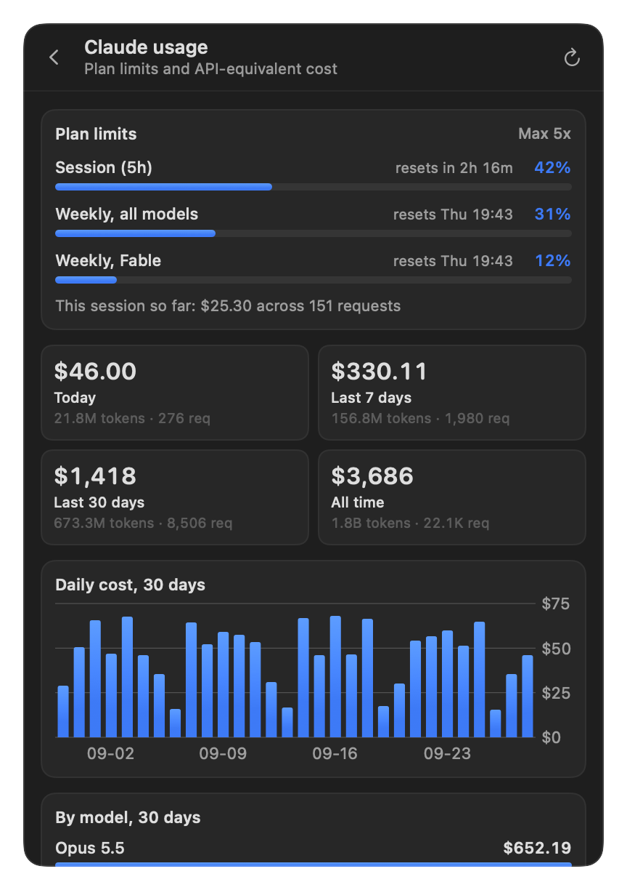 | 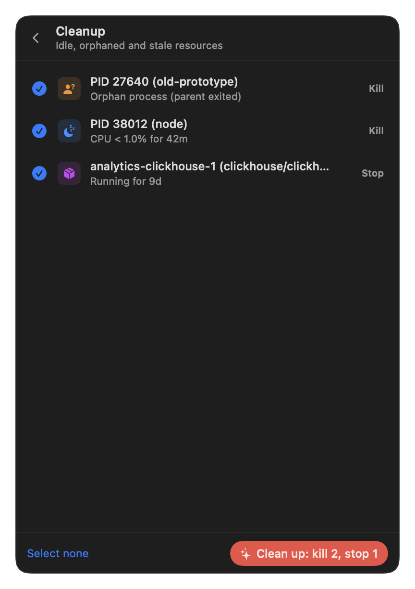 |
| **Claude project** | **Process details** | **Dependency graph** |
| 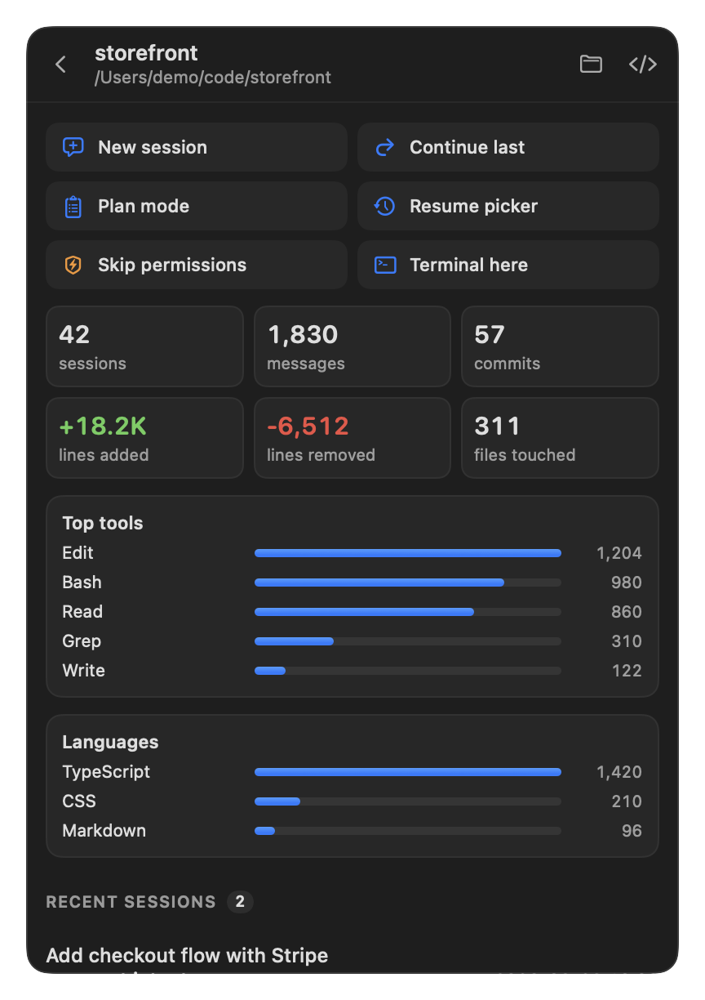 | 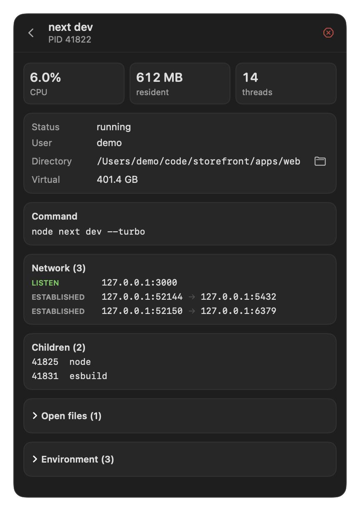 | 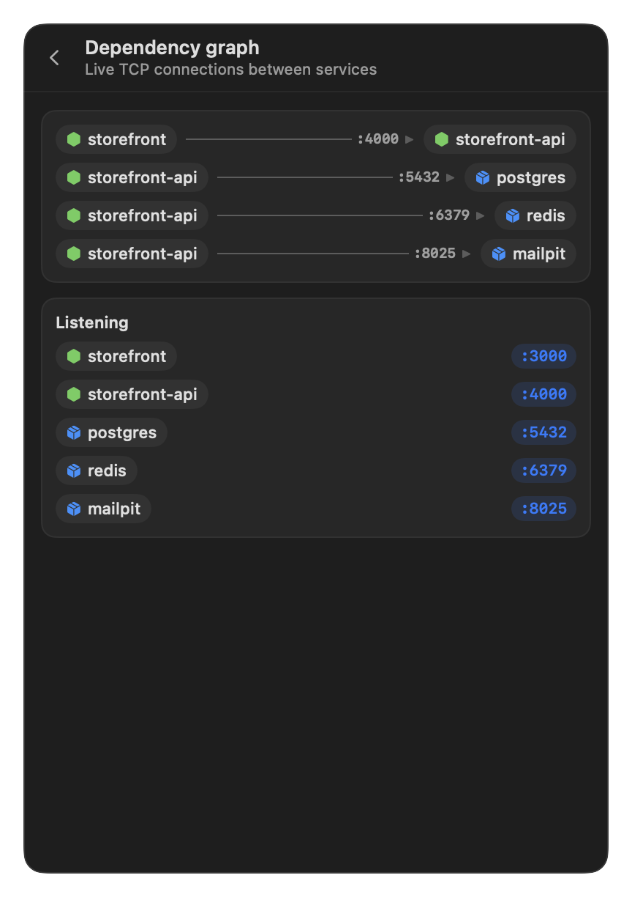 |

What you can do:

- **Dev**: click a port chip to open `localhost:<port>`. Hover a row to reveal it in Finder, open it in your editor, or kill it (click twice to confirm). Click a row for process details: command, children, network connections, open files and environment.
- **Docker**: containers are grouped by Compose project, and "Stop all" stops a whole stack. Click a container to stream its logs in a separate window, with filtering, follow mode and copy.
- **System**: memory, swap, disk and network usage, plus the top processes sorted by memory or CPU.
- **Claude**:
  - plan limits and API-equivalent cost;
  - running sessions, projects and recent sessions;
  - project pages with one-click launch: new session, continue, plan mode, resume picker, skip permissions, or a plain terminal in that folder.
- **Cleanup**: shown as a banner when devdash finds idle, orphaned or zombie processes, or containers running longer than your stale threshold. Pick which ones to remove and clean them up together.
- **Footer**: dependency graph, activity heatmap, JSON export, open the terminal UI, settings.
- **Notifications**: a macOS notification when a dev server starts or exits, a container stops, or a watched port comes up.
- **Settings**: launch at login, editor (VS Code or Cursor), whether the menu bar shows the count and usage percentage, notifications, and a custom `devdash` path.

### Claude usage and API-equivalent cost

The Claude tab has a usage card, and tapping it opens a detail page.

- **Plan limits**: the same 5-hour session and weekly limits (including per-model weekly limits) that Claude Code's `/usage` shows, with reset times and your plan name.
  - They're read with the Claude Code login already on your machine (the macOS keychain, or `~/.claude/.credentials.json` on other systems).
  - devdash never refreshes or stores that token. If it has expired, run Claude Code once.
- **API-equivalent cost**: what the tokens in your local Claude Code transcripts (`~/.claude/projects`) would cost at [Anthropic API list prices](https://platform.claude.com/docs/en/about-claude/pricing).
  - It accounts for per-model rates, 5-minute and 1-hour cache writes, cache reads, fast mode, web search and US-only inference.
  - It's shown for the current session, today, 7 days, 30 days and all time, broken down by model, project and token type.
  - Your subscription is billed separately; this number shows what the same work would cost on the API.

Everything is computed locally. The only network request is the plan-limits lookup to `api.anthropic.com`.

### How it works

The app is a small SwiftUI program that runs `devdash --serve` in the background. That process sends a JSON snapshot every few seconds and accepts commands (kill, stop, details, usage and so on) over stdin/stdout, so the terminal UI and the app share the same data code. If the CLI is missing or too old, the app shows the command to fix it and can run it in Terminal.

## Terminal UI

```sh
devdash
```

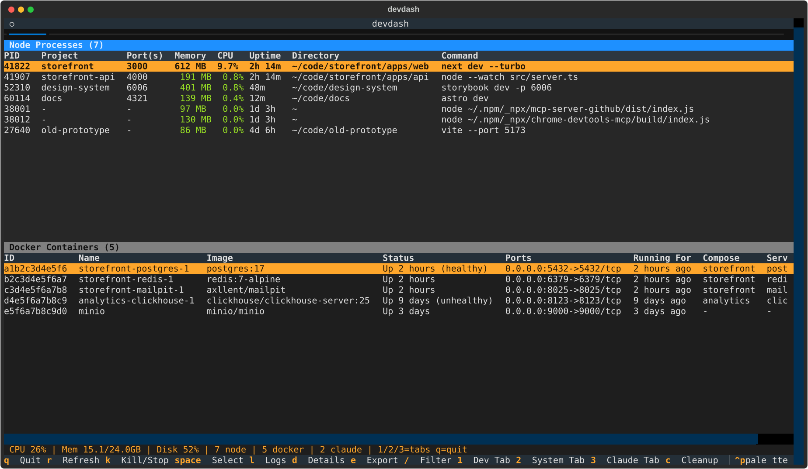

| System tab | Claude tab |
|---|---|
| 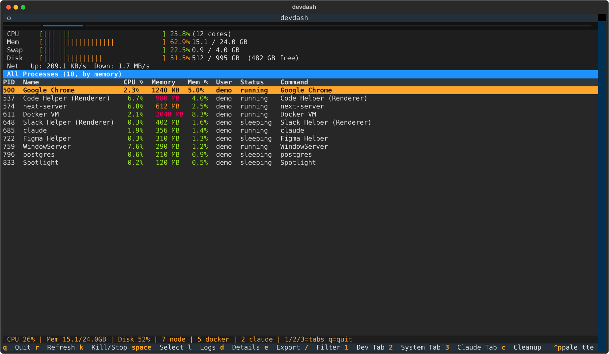 | 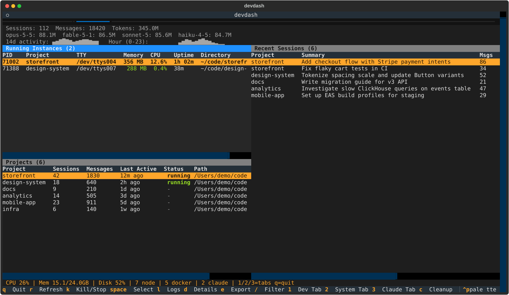 |

### Tabs

- **[1] Dev**: Node processes (PID, project, ports, memory, CPU, uptime, directory, command) and Docker containers (ID, name, image, status, ports, Compose project and service).
- **[2] System**: CPU, memory, swap and disk gauges, network rates, and the top processes by memory.
- **[3] Claude**: shown when Claude Code is installed.
  - Usage stats with a 14-day activity sparkline.
  - Running instances, projects, and the 50 most recent sessions.
  - Press `enter` on a project to open the launch menu: new session, skip permissions, plan mode, continue, resume, open in editor or Finder.

### Keybindings

| Key | Action |
|-----|--------|
| `1` / `2` / `3` | Dev / System / Claude tab |
| `tab` | Next table in the current tab |
| `/` | Filter across all columns |
| `k` | Kill process / stop container (with confirmation) |
| `space` | Select rows for batch kill/stop |
| `l` | Stream Docker container logs |
| `d` | Process details (environment, open files, connections, children) |
| `enter` | Claude project launch menu, or details |
| `s` | Browse and resume a Claude project's sessions |
| `c` | Cleanup suggestions |
| `g` | Dependency graph (which process talks to which port) |
| `h` | Claude activity heatmap |
| `e` | Export a JSON snapshot to `~/.local/share/devdash/` |
| `r` | Refresh |
| `ctrl+p` | Command palette |
| `Esc` | Close filter or modal |
| `q` | Quit |

Click a column header to sort, and click it again to reverse the order. Filters and sort order stay in place across refreshes, and the terminal UI shows a toast when a tracked process exits or a container disappears.

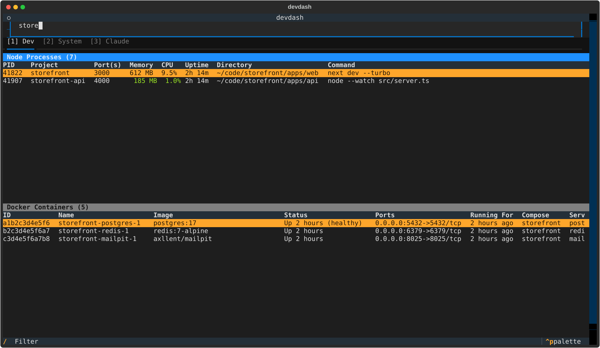

## Configuration

Optional, at `~/.config/devdash/config.toml`. The terminal UI and the menu bar app both use it.

```toml
refresh_rate = 3.0                  # seconds between refreshes
process_limit = 80                  # processes shown in the System tab
watched_ports = [3000, 8080]        # notify when a process starts listening on these
color_threshold_low = 50.0          # green -> yellow (%)
color_threshold_high = 80.0         # yellow -> red (%), also the menu bar warning
cleanup_idle_threshold_cpu = 1.0    # a Node process below this CPU % counts as idle
cleanup_idle_threshold_minutes = 10 # ...after this many minutes
cleanup_docker_stale_days = 7       # containers running longer than this are suggested for cleanup
```

## CLI

```sh
devdash                          # terminal UI
devdash --config path/to/config  # custom config file
devdash --update                 # update to the latest release
devdash --version                # print version
devdash --serve                  # JSON-lines bridge used by the menu bar app
devdash --serve --demo           # same protocol with synthetic data
```

## Development

```sh
git clone https://github.com/enso-works/devdash && cd devdash
python3 -m venv .venv && .venv/bin/pip install -e .
./run.sh                                  # terminal UI from the checkout
macos/scripts/build-app.sh                # build DevDash.app against this checkout, install to ~/Applications
```

The app needs Xcode 16+ (Swift 6) and macOS 14+. Useful tools:

| Command | What it does |
|---------|--------------|
| `python -m devdash.claude_usage` | Print the usage payload (limits and costs) as JSON |
| `macos/.build/debug/DevDashBar --selftest` | Start the bridge and check every command decodes |
| `DEVDASH_DEMO=1 macos/.build/debug/DevDashBar --render <dir>` | Render every app screen to PNG using demo data |
| `scripts/screenshots.sh` | Regenerate all README screenshots from demo data |
| `swift macos/scripts/make-icon.swift` | Regenerate the app icon |

### Releases

`macos/scripts/build-app.sh --release` builds a universal (Apple Silicon and Intel) app and writes a zip, a DMG and checksums to `macos/dist/`.

Pushing a `v*` tag runs [the macOS workflow](.github/workflows/macos-app.yml). It self-tests the bridge, builds the release, and attaches the artifacts to the GitHub release, where `install.sh` picks them up.

Without signing secrets, the app is ad-hoc signed. It opens normally when installed with `install.sh`. A copy downloaded in a browser has to be allowed once, in System Settings > Privacy & Security > Open Anyway. For a Developer ID signed and notarized build, add these repository secrets:

| Secret | Value |
|--------|-------|
| `MACOS_CERT_P12` | base64 of the exported Developer ID Application certificate (.p12) |
| `MACOS_CERT_PASSWORD` | password of the .p12 |
| `MACOS_SIGN_IDENTITY` | e.g. `Developer ID Application: Your Name (TEAMID)` |
| `APPLE_ID`, `APPLE_TEAM_ID`, `APPLE_APP_PASSWORD` | notarization credentials (app-specific password) |

Locally: `SIGN_IDENTITY=... NOTARY_PROFILE=<notarytool profile> macos/scripts/build-app.sh --release`.

### Project structure

```
devdash/
  app.py           # terminal UI: layout, bindings, data flow
  screens.py       # modal screens (logs, details, cleanup, graph, heatmap, launch menu)
  processes.py     # process, Docker, system and Claude Code data collection
  claude_usage.py  # plan limits and API-equivalent cost from transcripts
  bridge.py        # JSON-lines bridge for the menu bar app (--serve)
  demo.py          # synthetic data for --demo and screenshots
  cli.py           # command-line entry point
  config.py        # config file loading
  updater.py       # git-based self-update
macos/
  Sources/DevDashBar/   # SwiftUI menu bar app (bridge client, store, views)
  Resources/            # app icon
  scripts/              # build-app.sh, make-icon.swift
scripts/                # screenshot generation
.github/workflows/      # macOS build and release
install.sh              # one-line installer
```

## Uninstall

```sh
rm -rf ~/.devdash ~/.local/bin/devdash ~/Applications/DevDash.app
```

If you turned on launch at login, turn it off in the app's Settings first, or remove DevDash under System Settings > General > Login Items.

## License

[MIT](LICENSE)
